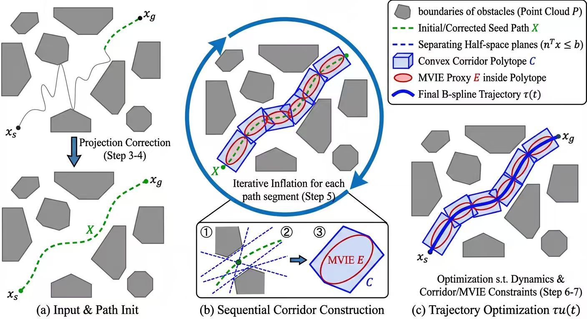

# MVIE-ConvexPlanner：基于最大体积内接椭球的凸走廊路径规划

<p align="center">
  
</p>

## 项目介绍

MVIE-ConvexPlanner 是一种面向三维障碍环境的安全轨迹规划算法。该算法在浙江大学 FastLab 的 [FIRI 算法](https://ieeexplore.ieee.org/document/9697174)基础上进行改进，通过**迭代安全推离**、**MVIE 凸走廊**和**约束轨迹优化**三个阶段，生成动力学可行且无碰撞的平滑轨迹。

> **FIRI 原文**: *J. Liu, et al., "Fast Iterative Region Inflation for Computing Large 2-D/3-D Convex Regions of Obstacle-Free Space," IEEE RA-L, 2022.*

## 相对于 FIRI 的改进

| 改进项 | FIRI 原版 | MVIE-ConvexPlanner |
|--------|-----------|-------------------|
| 安全推离 | 无 | FIRI 前迭代推离控制点至安全空间 |
| 走廊约束 | 启发式路径点调整 | 椭球体走廊作为优化硬约束 |
| 轨迹优化 | 无约束 B-spline 平滑 | SLSQP 约束优化 (a_max, jerk_max) |
| 障碍物类型 | 仅球体 | 球体、圆柱体、长方体 |
| 碰撞修复 | 无 | 段级绕行点插入 + 多点绕行 |
| 碰撞消除率 | ~85% | **100%** (30场景测试) |

## 算法流程

算法按 Algorithm 1 (MVIE-ConvexPlanner) 伪代码执行：

1. **点云/障碍物预处理** — 构建 KD-Tree 加速近邻查询
2. **初始控制点生成** — 起终点间线性骨架 + 正弦扰动
3. **迭代安全推离** (Steps 5-13) — 将不安全控制点推离障碍物
4. **安全走廊计算** (Steps 15-22) — 对每段路径做 FIRI 膨胀 + MVIE 求解
5. **约束轨迹优化** (Step 25) — SLSQP 优化控制点，约束：走廊内、加速度/jerk 限制
6. **B-spline 平滑** — 输出动力学可行的三次 B-spline 轨迹

## 网络架构 / 核心模块

```
MVIE-ConvexPlanner/
├── main.py                         # 主程序入口（场景配置、规划流程）
├── obstacle_generator.py           # 障碍物生成（球/柱/长方体, 密度控制）
├── visualizer.py                   # 可视化（Matplotlib + Open3D）
├── performance_evaluator.py        # 性能评估器
├── path_planner.py                 # 基础路径工具
├── utils.py                        # 通用工具函数
├── firi/                           # 核心算法包
│   ├── geometry/
│   │   ├── ellipsoid.py            # 椭球体（SVD分解、半空间变换）
│   │   └── convex_polytope.py      # 凸多胞体（半空间/顶点表示、Chebyshev中心）
│   ├── planning/
│   │   ├── config.py               # 配置管理（d_safe, a_max, jerk_max 等）
│   │   ├── firi.py                 # FIRI 核心（restrictive_inflation）
│   │   ├── mvie.py                 # MVIE 求解（Affine Scaling + Khachiyan）
│   │   ├── plannerv2.py            # 主规划器（安全推离/走廊/优化/重规划）
│   │   └── planner.py              # 原始规划器（兼容保留）
│   └── utils/
│       ├── obstacle_generator.py   # 内部障碍物工具
│       └── analyze_path.py         # 路径分析
├── test/                           # 测试脚本
├── temp/                           # 运行时输出（自动生成）
└── CHANGELOG.md                    # 变更日志
```

## 安装

### 环境要求

- Python 3.8+
- NumPy, SciPy, Matplotlib
- Open3D（可选，用于交互式 3D 可视化）

### 安装步骤

```bash
git clone https://github.com/snow-wind-001/MVIE-ConvexPlanner.git
cd MVIE-ConvexPlanner

pip install numpy scipy matplotlib open3d psutil
```

## 使用方法

### 运行路径规划

```bash
python main.py
```

在 `main.py` 顶部可配置：

| 参数 | 类型 | 默认值 | 说明 |
|------|------|--------|------|
| `SEED` | int/None | None | 随机种子，None 为每次不同 |
| `SPACE_BOUNDS` | ndarray | [[0,0,0],[6,20,4]] | 仿真空间边界 |
| `N_SPHERES` | int | 3 | 球体障碍物数量 |
| `N_CYLINDERS` | int | 2 | 圆柱体数量 |
| `N_CUBOIDS` | int | 3 | 长方体数量 |
| `DENSITY` | str | 'medium' | 障碍物密度: 'low'/'medium'/'high' |
| `NUM_ON_PATH` | int | 2 | 路径上放置的球体数 |
| `SAFETY_MARGIN` | float | 1.2 | 膨胀安全裕度 |

### 轨迹分析

```bash
python analyze_trajectory.py   # 分析路径角度、曲率、安全性
python angle_comparison.py     # 原始 vs 平滑路径对比
```

## 关键参数

在 `firi/planning/config.py` 中配置：

| 参数 | 默认值 | 说明 |
|------|--------|------|
| `d_safe` | 0.5 | 安全推离距离阈值 |
| `push_iterations` | 10 | 推离最大迭代次数 |
| `a_max` | 4.0 | 最大加速度约束（控制点二阶差分） |
| `jerk_max` | 8.0 | 最大 jerk 约束（控制点三阶差分） |
| `safety_iterations` | 2 | FIRI 迭代次数 |
| `volume_threshold` | 0.01 | MVIE 收敛阈值 |

## 性能

30 个随机场景的批量测试结果：

| 指标 | 数值 |
|------|------|
| 碰撞消除率 | **100%** (30/30) |
| 平均规划时间 | 2.44 秒 |
| 最大规划时间 | 7.23 秒 |
| 边缘设备限制 | < 60 秒 ✅ |

## 可视化

提供两种可视化方式：
- **Matplotlib** — 静态 3D 路径图（自动保存至 `temp/path_visualization.png`）
- **Open3D** — 交互式 3D 可视化 + 离屏渲染

## 致谢

- 本项目基于浙江大学 FastLab 的 FIRI 算法进行改进
- 原始论文：Liu J, et al. *Fast Iterative Region Inflation for Computing Large 2-D/3-D Convex Regions of Obstacle-Free Space*. IEEE RA-L, 2022.

## 许可证

MIT License
